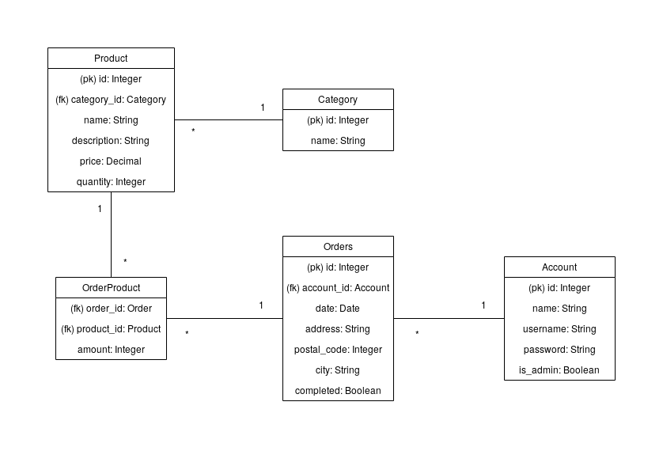

## Työkalukauppa

Harjoitustyön aiheena on verkkokauppa, jossa myydään rakennustarvikkeita. Sovelluksen toiminnallisuuksiin kuuluu mm. tuotekategorioiden, tuotteiden ja käyttäjien hallinnointi, sekä tilausten tekeminen.

Ylläpitäjän näkymiin päästäkseen on kirjauduttava seuraavilla tunnuksilla:  
Käyttäjänimi: admin  
Salasana: 12345

<https://tyokalukauppa.herokuapp.com/>

[Asennusohje](documentation/Asennusohje.md)

[Käyttöohje](documentation/Käyttöohje.md)

[Käyttötapaukset](documentation/Käyttötapaukset.md)

[Tietokantarakenne](documentation/Tietokantarakenne.md)

[Sovelluksen rajoitteet ja puuttuvat ominaisuudet](documentation/Rajoitteet%20ja%20puuttuvat%20ominaisuudet.md)

